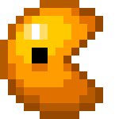

# Pac-Man Game



This project is a Pac-Man game implemented using TypeScript and React. The game features classic Pac-Man gameplay, including ghosts, pellets, and a maze.

## Table of Contents

- [Installation](#installation)
- [Usage](#usage)
- [License](#license)

## Installation

1. Clone the repository:
  ```bash
  git clone https://github.com/yourusername/pacman-game.git
  ```
2. Navigate to the project directory:
  ```bash
  cd pacman-game
  ```
3. Install the dependencies:
  ```bash
  npm install
  ``## Usage

1. Start the development server:
  ```bash
  npm start
  ```
2. Open your browser and navigate to `http://localhost:3000` to play the game.

## License

## License

This project was developed as part of a university coursework assignment and is intended solely for educational purposes. The use of this project is not meant for commercial purposes. Redistribution, modification, or any other use of the code or assets in this repository for commercial gain is not permitted.
